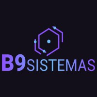

<h1 align="center">
    
</h1>

  <a href="#-tecnologias">Tecnologias</a>&nbsp;&nbsp;&nbsp;|&nbsp;&nbsp;&nbsp;
  <a href="#-projeto">Projeto</a>&nbsp;&nbsp;&nbsp;|&nbsp;&nbsp;&nbsp;
  <a href="#-como-executar">Como executar</a>&nbsp;&nbsp;&nbsp;|&nbsp;&nbsp;&nbsp;  

 

## ✨ Tecnologias

Esse projeto foi desenvolvido com as seguintes tecnologias:

- [Node](https://nodejs.org/en/)
- [TypeScript](https://www.typescriptlang.org/)
- [Prisma](https://www.prisma.io/)
- [Postgresql](https://www.postgresql.org/)
- [Docker](https://www.docker.com/)
- [Swagger](https://swagger.io/)

## 💻 Projeto

Projeto desenvolvido para o processo seletivo da B9 Sistemas. A API consiste em um sistema básico de vendas, permitindo realização do cadastro de usuários, cadastro de produtos e realização de vendas.

## 🚀 Como executar

- Clone o repositório
- Instale as dependências com `npm install ou yarn`
- Inicie o container do Postgresql com `docker-compose up`
- Inicie o servidor com `npm run dev ou yarn dev`

Agora você pode acessar [`localhost:4000/api-docs`](http://localhost:4000/api-docs) do seu navegador para ter acesso a documentação da API.

---

Feito com ♥ por [Júlio Souza](https://www.linkedin.com/in/j%C3%BAlio-souza-079351213/) 👋🏻 
